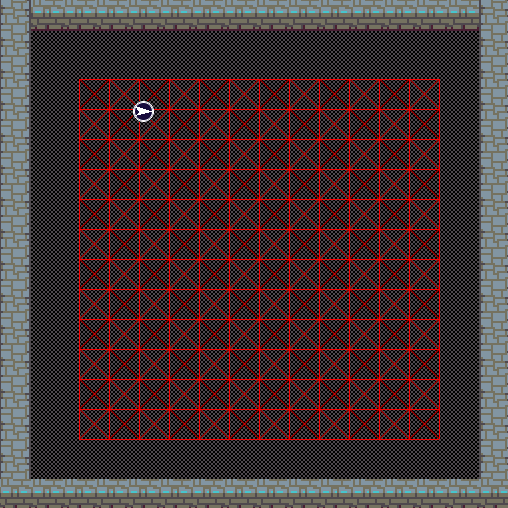
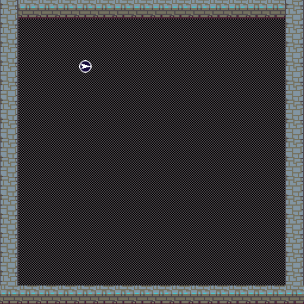
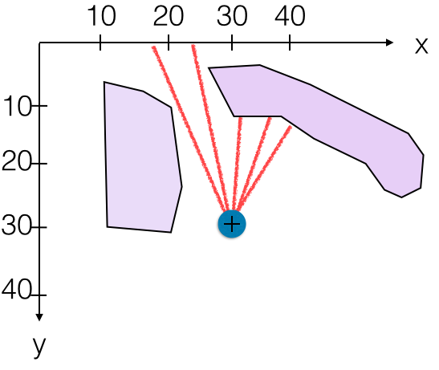

# pythonRobotVirtuel

**Rappel** vous trouverez les instructions pour l'installation de
l'environnement de travail [ici](http://lipn.univ-paris13.fr/~leroux/INFO2_ROBO/environnement.html).

La dernière fois, vous avez traité le problème de la **planification**
(c'est-à-dire la recherche de trajectoire).
On supposait qu'on connaissait la position des obstacles.

Aujourd'hui, nous levons cette hypothèse, et le robot devra explorer de
lui-même son environnement pour recréer le plan.
C'est la phase de **mapping**.

Dès lors que le plan est suffisament bien connu, on pourra faire de la
planification comme au TP précédent.

On cherchera donc à obtenir le même type graphe qu'au TP précédent, mais
uniquement à l'aide du télémètre du robot.
Vous n'aurez donc pas le droit d'appeler la fonction `obstacle_coords`,
qui supposait de connaitre le plan.

Donc la première chose à faire pour vous sera celle-ci:

-   créer un graphe \(G\) couvrant le terrain (à l'aide de l'une des
    fonction développées au TP précédent).
    Comme pour le TP précédent, vous choisierez un espacement de 30
    pixels entre chaque noeud. Vous devriez obtenir ceci:

    

Dans la suite du TP, le robot devra parcourir ce graphe \(G\) en prenant
des mesures, et éliminer une par une les arêtes du graphe encombrées
d'obstacles. À la fin, on devrait obtenir un graphe permettant au
robot de se déplacer d'un bout à l'autre du territoire sans rencontrer
d'obstacle.

# Introduction

Tout d'abord, un rappel des commandes utiles pour ce TP:

    # Commandes de navigation
    avance, oriente, tournegauche, tournedroite

    # Capteurs
    telemetre, position, orientation

    # Dessin
    line, efface

Le robot circulera sur une carte dont les obstacles sont invisibles.
Seuls les murs d'enceinte sont visibles.
La voici:

Pour la charger en Python, votre code devra commencer ainsi:

    from robosim import *
    init('robot_obstacles_invisibles')

Les obstacles n'apparaissent pas, ils sont invisibles, mais ils sont
bien là !!!

-   Pour vous en convaincre, commandez au robot de traverser le
    territoire en diagonale (vers le coin en bas à gauche).
-   Reprenez le code des fonctions du TP précédent, notamment celui de
    la fonction `aller(x,y)` et étendez le afin que le
    robot puisse se diriger dans n'importe quelle direction

# Évaluer les arêtes proches

Dans cette partie, le robot devra estimer si les 8 arêtes qui
entourent sa position peuvent être parcourues on non.

Supposons que le robot soit aux coordonnées \((30,30)\) et qu'il
veuille tester si l'arête menant au noeud \((30,20)\) est *parcourable*.
Dans ce cas, le robot devra utiliser son télémètre avec un certain
angle pour vérifier s'il peut avancer (voir dessin ci-dessous).

-   Orientez votre robot vers le Nord. Écrivez une fonction `testArete(G)`
    qui renvoie `True` si le robot peut se déplacer le long de l'arête
    qui lui fait face, sans rencontrer d'obstacle.
-   Attention, il ne faut pas lancer seulement un rayon, mais plusieurs comme
    dans la figure. Pour information, le robot a une taille de 22
    pixels de diamètre.
-   Écrire une fonction `effaceLesAretesBloquees(G)`. Dans cette
    fonction, le robot doit tourner sur lui-meme, faire des mesures
    de télémètre et en déduire pour chacune des 8 arêtes qui l'entoure
    si le robot peut traverser cette arête ou s'il rencontrera un
    obstacle. Il devra enlever de \(G\) les arêtes qu'il ne peut pas
    parcourir.

Ces deux fonctions sont très importantes.
Pour être certain qu'elles fonctionnent bien, vous pourriez les valider
sur le terrain du TP précédent où les obstacles étaient visibles (ce terrain
peut être chargé avec `init('robot_obstacles')`), en positionnant le
robot près d'un obstacle et en vérifiant que les arêtes y menant sont
bien détruites.

# Explorer le graphe

On dira qu'un noeud est *connu* si et seulement si `effaceLesAretesBloquees(G)`
a été lancé dessus. Dans la suite du TP, \(K\) désignera l'ensemble
des noeuds connus.

Si le robot est sur un noeud connu (autrement dit si \(position() \in K\)),  alors il peut emprunter chacune des arêtes connectées au noeud
sans risque immédiat de heurter un obstacle.

## Algorithme Principal

On suppose que le graphe \(G\) couvrant l'ensemble du territoire est
déjà construit. On suppose aussi que le robot est positionné sur un
noeud de \(G\).
Si ce n'est pas le cas, utilisez la fonction `teleporte(x,y)`
pour bien repositionner le robot.

Voila l'algorithme principal, qui ne s'arête que quand tous les noeuds sont
connus:

---

`Fonction Main()`

1.  \(K \leftarrow \emptyset\)
2.  Tant que \(K \neq G.nodes()\) faire:
    1.  Si \(position() \notin K\) faire:
        1.  Lancer `effaceLesAretesBloquees(G)`
        2.  \(K \leftarrow K \cup \{ position() \}\)
    2.  `explorer(` \(G.nodes() \backslash K\) `)`

---

Attention: la fonction position renvoie un couple de flottants, par
exemple `(80.3,50.7)`.
Il faut les convertir en entiers avant de tester s'il apparaissent
dans \(K\)

La fonction `explorer` reste à définir. Elle prend en paramètre l'ensemble des noeuds inconnus.
Elle doit choisir une arête ou un chemin à parcourir parmi ceux que
le robot peut emprunter.

Nous proposons plusieurs méthodes. La première est une exploration
aléatoire:

---

`Fonction explorer_random(G,K)`

1.  Choisir une arête au hasard partant de la position courante
2.  Traverser cette arête

---

-   Implémentez l'algorithme principale et la fonction `explorer_random`
-   Testez votre code

# Stratégies d'Exploration efficace

Ici, le robot cherchera à sortir le plus vite possible de \(K\), afin
d'explorer le plus de noeuds inconnus possible.

---

`Fonction exploration_pluscourtchemin(G,K)`

1.  Pour chaque noeud inconnu \((i,j) \in G.nodes() \backslash K\) faire
    1.  Calculer le plus court chemin du robot jusqu'à \((i,j)\)
    2.  Parmi tous ces noeuds inconnus, sélectionner le noeud inconnu
        \((i*,j*)\) le plus proche du robot
    3.  Se diriger vers ce noeud \((i*,j*)\) et stopper dès que le robot
        atteint un noeud hors de \(K\)

---

# Bonus: Exploration Améliorée

Dans l'appel à la fonction d'exploration `explorer`, il n'est pas
nécessaire de passer en paramètre l'ensemble des noeuds inconnus.
Seuls les noeuds frontières comptent.

On dira qu'un noeud est *frontière* si et seulement s'il n'est pas
connu, mais il est connecté par une arête à un noeud connu.
Dans la suite du TP, \(F\) désignera l'ensemble des noeuds frontières.

Quand le robot sort de la zone connue, le (ou les) premier(s) noeud(s) qu'il
visite sont des noeuds frontières.

## Algorithme Principal d'Exploration Améliorée

1.  Construire le graphe \(G\) couvrant l'ensemble du territoire.
2.  On suppose que le robot est au début sur un noeud de \(G\).
    Donc \(position() \in G.nodes()\)
3.  \(K \leftarrow \emptyset , F \leftarrow \emptyset\)
4.  Tant que \(K \neq G.nodes()\) faire
    1.  si \(position() \notin K\) faire
        1.  `effaceLesAretesBloquees(G)`
        2.  \(K \leftarrow K \cup \{ position() \}\)
        3.  \(V \leftarrow noeuds\,voisins\,de\,position()\)
        4.  \(F \leftarrow (F \cup V) \backslash K\)
    2.  `explorer(F)`
